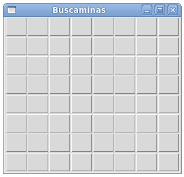
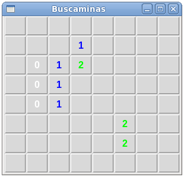
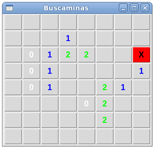

Buscaminas
==========
Descarge y pruebe `este programa`_
que es una implementación del juego Buscaminas.

.. _este programa: ../../_static/programas/tkinter/buscaminas.py

El juego consiste en descubrir
las casillas de un campo minado que no tienen minas.
Al pisar una casilla que tiene una mina, se termina el juego.
El campo minado se representa como una grilla de botones:

Al hacer clic en una casilla no minada,
aparece un número que indica en cuántas de las ocho casillas vecinas
hay una mina:

Si se hace clic en una mina,
el juego termina:

#. Modifique el programa
   para que aparezca un mensaje en la parte inferior de la ventana
   indicando cuántas casillas no minadas
   faltan por ser descubiertas.
   Cada vez que se haga clic en una nueva casilla,
   el mensaje debe ser actualizado:

   .. image:: ../../_static/capturas/bm3.png

#. Modifique el programa
   para que al hacer clic en una mina
   se muestren los contenidos de todas las celdas del campo minado.
   En la etiqueta inferior debe mostrarse el mensaje «¡Perdiste!».
   La mina que fue pisada debe ser indicada con una equis:

   .. image:: ../../_static/capturas/bm4.png

#. Modifique el programa
   para que aparezca el mensaje «¡Ganaste!»
   cuando todas las casillas no minadas
   hayan sido descubiertas.

   .. image:: ../../_static/capturas/bm5.png
