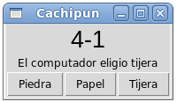

Cachipún
========
Escriba un programa para jugar cachipún contra el computador.
La interfaz debe ser la siguiente:

Cada vez que usted haga clic en un botón,
el computador debe elegir al azar su jugada
(piedra, papel o tijera),
y mostrarla en la etiqueta («El computador eligió...»).
Además,
hay que actualizar el marcador
que indica cuántas veces ha ganado cada uno.
En el ejemplo de la imagen,
el humano ha ganado cuatro veces,
y el computador una.

La regla para saber quién ganó es:
piedra le gana a tijera,
tijera le gana a papel,
papel le gana a piedra.
El resto de las combinaciones posibles son todas empates.

