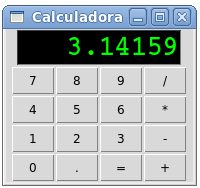

Calculadora
===========
Descargue y pruebe `este programa`_ que crea una calculadora:

.. _este programa: ../../_static/programas/tkinter/calculadora.py

La única parte de la calculadora que no funciona es el botón :kbd:`=`.
Su controlador es la función ``calcular``,
que debe ser implementada
para que el botón haga lo que tiene que hacer.

Complete el programa
escribiendo el código que falta en la función ``calcular``.

