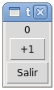
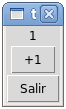
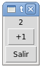
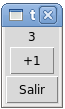

Contador de clics
=================
Escriba un programa con la siguiente interfaz:

Cada vez que se haga clic en el botón :kbd:`+1`,
el número en la parte superior debe aumentar en uno.

Al hacer clic en el botón :kbd:`Salir`,
el programa debe terminar.
