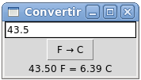

Conversor de temperatura
========================
Escriba un programa para convertir grados Fahrenheit a Celsius.
El programa debe verse así:

Al hacer clic en el botón,
debe actualizarse el mensaje en la parte inferior de la ventana.

