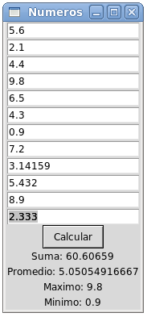

Estadísticas de números
-----------------------
Escriba un programa que muestre
la suma, el promedio, el máximo y el mínimo
de una secuencia de números.

El programa debe verse así:

Al hacer clic en :kbd:`Calcular`,
deben actualizarse los mensajes en la parte inferior.

Es mala idea crear los modelos y los campos de entrada
de la siguiente manera::

    v1 = StringVar()
    e1 = Entry(w, textvariable=v1)

    v2 = StringVar()
    e2 = Entry(w, textvariable=v2)

    # ...

Un buen programador siempre busca la manera
de evitar escribir código repetitivo.
Use ciclos y listas con este propósito.
