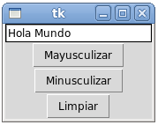
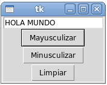

Mayusculizador
==============
Escriba un programa con la siguiente interfaz:

Al hacer clic en el botón :kbd:`Mayusculizar`,
el texto del campo superior debe ser convertido a mayúsculas:

Al hacer clic en :kbd:`Minusculizar`,
debe ser convertido a minúsculas.

Al hacer clic en :kbd:`Limpiar`,
debe borrarse el contenido del campo.

