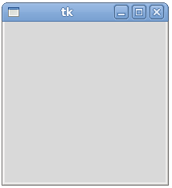
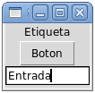
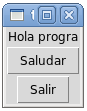

Interfaces gráficas
===================

Todo programa necesita contar con algún mecanismo
para recibir la entrada y entregar la salida.
Ya hemos visto dos maneras de hacer entrada:

* entrada por teclado (``raw_input``), y
* entrada por archivo (``for linea in archivo: ...``);

y dos maneras de hacer salida:

* salida por consola (``print``), y
* salida por archivo (``archivo.write(...)``).

.. index:: interfaz gráfica

La mayoría de los programas que ocupamos a diario no funcionan así,
sino que tienen una **interfaz gráfica**,
compuesta por ventanas, menúes, botones y otros elementos,
a través de los cuales podemos interactuar con el programa.

Los programas con interfaces gráficas
son fundamentalmente diferentes a los programas
con interfaces de texto.
Los programas que hemos escrito hasta ahora
se ejecutan completamente de principio a fin,
deteniéndose sólo cuando debemos ingresar datos.

Los programas gráficos, por otra parte,
realizan acciones sólo cuando ocurren
ciertos eventos provocados por el usuario
(como hacer clic en un botón, o escribir algo en una casilla de texto),
y el resto del tiempo se quedan esperando que algo ocurra, sin hacer nada.
El programa no tiene control sobre cuándo debe hacer algo.
Esto requiere que los programas sean estructurados
de una manera especial, que iremos aprendiendo de a poco.

.. index:: Tkinter

Python incluye un módulo llamado ``Tkinter``
que provee todas las funciones necesarias,
que deben ser importadas al principio del programa::

    from Tkinter import *

Creación de la ventana
----------------------
El siguiente programa
es la interfaz gráfica más simple que se puede crear::

    from Tkinter import *
    w = Tk()
    w.mainloop()

Haga la prueba:
copie este programa en el editor de texto,
guárdelo y ejecútelo.
Debería aparecer una ventana vacía:

La sentencia ``w = Tk()``
crea la ventana principal del programa,
y la asigna a la variable ``w``.
Toda interfaz gráfica debe tener una ventana principal
en la que se irán agregando cosas.
Esta línea va al principio del programa.

La sentencia ``w.mainloop()``
indica a la interfaz que debe quedarse esperando
a que el usuario haga algo.
Esta línea siempre debe ir al final del programa.

.. index:: ciclo de eventos

Al ejecutarlo,
puede darse cuenta que el programa no termina.
Esto ocurre porque la llamada al método ``mainloop()``
se «queda pegada» esperando que algo ocurra.
Esto se llama un **ciclo de eventos**,
y es simplemente un ciclo infinito que está continuamente esperando
que algo ocurra.

Todos los programas con interfaz gráfica
deben seguir esta estructura:
la creación de la ventana al principio del programa
y la llamada al ciclo de eventos al final del programa.

Creación de widgets
-------------------
.. index:: widget

Un **widget** es cualquier cosa que uno puede poner en una ventana.
Por ahora, veremos tres tipos de widgets sencillos,
que son suficientes para crear una interfaz gráfica funcional:

* las **etiquetas** (``Label``)
  sirven para mostrar datos,
* los **botones** (``Button``)
  sirven para hacer que algo ocurra en el programa, y
* los **campos de entrada** (``Entry``)
  sirven para ingresar datos al programa.

En un programa en ejecución,
estos widgets se ven así:

El ``Entry`` es análogo al ``raw_input``
de los programas de consola:
sirve para que el programa reciba la entrada.
El ``Label`` es análogo al  ``print``:
sirve para que el programa entregue la salida.

Un botón puede ser visto como un «llamador de funciones»:
cada vez que un botón es presionado,
se hace una llamada a la función asociada a ese botón.
Los botones no tienen un análogo,
pues los programas de consola
se ejecutan de principio a fin inmediatamente,
y por esto no necesitan que las llamadas a las funciones
sean gatilladas por el usuario.

Para agregar un widget a un programa,
hay que ocupar las funciones con los nombres de los widgets
(``Label``, ``Button`` y ``Entry``).
Estas funciones reciben como primer parámetro obligatorio
la ventana que contendrá el widget.
Además,
tienen parámetros opcionales
que deben ser pasados usando la sintaxis de asignación
de parámetros por nombre.
Por ejemplo,
el parámetro ``text`` sirve para indicar
cuál es el texto que aparecerá en un botón o en una etiqueta.

Por ejemplo,
la siguiente sentencia
crea un botón con el texto ``Saludar``,
contenido en la ventana ``w``::

    b = Button(w, text='Saludar')

Si bien esto crea el botón
y lo asigna a la variable ``b``,
el botón no es agregado a la ventana ``w`` inmediatamente:
lo que hicimos fue simplemente decirle al botón cuál es su contenedor,
para que lo tenga en cuenta al momento de ser agregado.
Para que esto ocurra,
debemos llamar al método ``pack``,
que es una manera de decirle al widget
«empaquétate dentro de tu contenedor»::

    b.pack()

Como referencia,
el programa que crea la ventana de la imagen
es el siguiente (¡pruébelo!):

.. literalinclude:: ../diapos/programas/tk-widgets.py

Los widgets van siendo apilados verticalmente,
desde arriba hacia abajo,
en el mismo orden en que van siendo apilados.
Ya veremos cómo empaquetarlos en otras direcciones.

Controladores
-------------
Al crear un botón de la siguiente manera::

    b = Button(w, text='Saludar')

no hay ninguna acción asociada a él.
Al hacer clic en el botón, nada ocurrirá.

Para que ocurra algo al hacer clic en el botón,
hay que asociarle una acción.
Un **controlador** es una función
que será ejecutada al hacer clic en un botón.

Los controladores deben ser funciones
que no reciben ningún parámetro.

Por ejemplo,
supongamos que queremos que el programa
imprima el mensaje ``Hola`` en la consola
cada vez que se haga clic en el botón que dice «Saludar».
Primero, hay que crear el controlador::

    def saludar():
        print 'Hola'

Para asociar el controlador al botón,
hay que pasarlo a través del parámetro ``command``
(en inglés: «orden»)
al momento de crear el botón::

    b = Button(w, text='Saludar', command=saludar)

Esta línea significa:
crear el botón ``b``,
contenido en la ventana ``w``,
que tenga el texto ``'Saludar'``
y que al hacer clic en él se ejecute la función ``saludar``.

El siguiente ejemplo es un programa completo
que tiene dos botones:
uno para saludar y otro para salir del programa.
El controlador del segundo botón
es la función ``exit``,
que ya viene con Python:

.. literalinclude:: ../diapos/programas/tkinter/05-controladores.py

El programa se ve así:

Ejecute el programa,
y pruebe lo que ocurre al hacer clic
en ambos botones.

Modelos
-------
Mediante el uso de controladores,
ya podemos hacer interfaces que hagan algo,
pero que siguen teniendo una limitación:
las interfaces sólo reaccionan a eventos que ocurren,
pero no tienen memoria para recordar información.

Un **modelo** es un dato almacenado
que está asociado a la interfaz.
Usando modelos, se puede lograr
que la interfaz vaya cambiando su estado interno
a medida que ocurren eventos.

En general,
a la hora de crear un programa con interfaz gráfica,
debemos crear un modelo para cada dato
que deba ser recordado durante el programa.

Tkinter rovee varios tipos de modelos,
pero para simplificar podemos limitarnos a usar
sólo modelos de tipo string.
Un modelo puede ser creado de la siguiente manera::

    m = StringVar()

Aquí,
el modelo ``m`` es capaz de recordar un string

Para modificar el valor del modelo ``m``,
se debe usar el método ``set``,
que recibe el valor como único parámetro::

    m.set('hola')

Para obtener el valor del modelo ``m``,
se debe usar el método ``get``,
que no recibe ningún parámetro::

    s = m.get()

En este ejemplo,
la variable ``s`` toma el valor ``'hola'``.

Como los modelos creados por ``StringVar``
almacenan datos de tipo string,
hay que tener cuidado de hacer las conversiones apropiadas
si se desea usar datos numéricos::

    a = StringVar()
    b = StringVar()
    a.set(5)                # es convertido a string
    b.set(8)                # es convertido a string
    print a.get() + b.get()             # imprime 58
    print int(a.get()) + int(b.get())   # imprime 13

Usted podría preguntarse
cuál es la razón para usar modelos
en vez de usar las variables propias de Python,
—es decir, las que son creadas mediante asignaciones—
para almacenar los datos.
Los modelos tienen la ventaja
que es posible asociarlos a elementos de la interfaz
que responden automáticamente
cuando el valor del modelo cambia.

Por ejemplo,
podemos asociar una etiqueta a un modelo.
La etiqueta siempre mostrará en la interfaz
el valor que tiene el modelo,
incluso cuando éste cambie.

Para asociar un modelo a una etiqueta,
hay que usar el parámetro ``textvariable``::

    x = StringVar()
    l = Label(w, textvariable=x)
    l.pack()

Cada vez que cambie el valor del modelo ``x``,
el texto de la etiqueta será actualizado inmediatamente.

También podemos asociar un campo de entrada a un modelo.
El valor asociado al modelo
siempre será el texto que está ingresado en el campo.

Para asociar un modelo a un campo de texto,
también se usa el parámetro ``textvariable``::

    x = StringVar()
    e = Entry(w, textvariable=x)
    e.pack()

Cuando se obtenga el valor del modelo
mediante la llamada ``x.get()``,
el valor retornado será lo que el usuario haya ingresado
en el campo hasta ese momento.

Resumen
-------
Para diseñar un programa que tiene una interfaz gráfica,
hay tres elementos importantes que hay que tener en consideración.

#. Los elementos que componen la interfaz.
   A esto se le suele denominar la **vista** del programa.
#. Los **modelos** que mantienen el estado de la interfaz
   en todo momento.
#. Los **controladores** que reaccionan a eventos del usuario.

Los controladores pueden interactuar con los modelos
mediante sus métodos ``get`` y ``set``.
Los cambios en los modelos
pueden verse reflejados en la vista.
