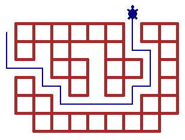

Tarea 1: la tortuga urbana
==========================

.. raw:: html

    <iframe width="560" height="315" src="http://www.youtube.com/embed/oCDmNaGMEi4?rel=0" frameborder="0" allowfullscreen></iframe>

Objetivos de aprendizaje
------------------------
Después de resolver la tarea 1, usted será capaz de:

* implementar un programa que requiera entradas y salidas;
* diseñar e implementar programas simples
  usando algunas sentencias elementales de Python
  (asignaciones, ``if``, ``for`` y ``while``);
* entender el proceso de
  desarrollar y probar un programa en el computador
  usando las herramientas de desarrollo del lenguaje
  (intérprete, consola, IDE);
* usar el módulo ``turtle`` para hacer dibujos sencillos.

Enunciado
---------
La tarea consiste en desarrollar un programa
que permita darle instrucciones a una tortuga
para que dibuje el plano de una ciudad,
y a continuación recorra una ruta a través de ella.

Para familiarizarse con las funciones que manejan la tortuga,
revise la `documentación`_ que hemos preparado.

.. _documentación: turtle.html

El siguiente es un ejemplo de ejecución del programa:

.. code-block:: none

    > `XXXXXX XX`
    > `X X  X  X`
    >   `XX XX X`
    > `X  X X  X`
    > `XX     XX`
    >  `XXXXXXX`
    >
    Ruta: `SSEESESEEEENENNONN`
    Distancia recorrida: 18

La imagen final resultante es la siguiente:

Al principio,
el usuario ingresa el plano escribiendo varias líneas,
en las que un caracter ``X`` (equis mayúscula) indica una cuadra de la ciudad
y un espacio en blanco una calle.
A medida que se ingresan las líneas,
la tortuga debe ir dibujando las cuadras.

Para indicar que el plano ya está terminado,
el usuario debe ingresar una línea en blanco.
Cuando ocurre esto,
la tortuga debe regresar a la posición al frente de la primera cuadra de la ciudad
(arriba a la izquierda),
y el programa debe preguntar al usuario cuál es la ruta que debe recorrer la tortuga.

La ruta que debe ingresar el usuario
es una secuencia de caracteres ``N``, ``S``, ``E`` u ``O``
(todos en mayúsculas)
que indican que la tortuga debe moverse, respectivamente,
hacia el norte, el sur, el este o el oeste.
Una vez ingresada la ruta,
la tortuga debe recorrerla.

Finalmente,
el programa debe mostrar cuál fue la distancia total
recorrida por la tortuga.

No es necesario que el programa revise que la entrada es correcta.
Puede suponer que el usuario no ingresará datos inválidos.

Entrega
-------
La fecha de entrega es el **domingo 16 de septiembre** a las **23:00**.

La tarea debe ser resuelta en **equipos de dos o tres personas**.

Sólo uno de los integrantes del equipo debe subir la tarea
en la sección **Entrega de tareas** de la plataforma Moodle_,
ingresando al campus que corresponda.
¡No la suba a la sección de su paralelo!

Se debe entregar un archivo con el nombre ``tarea-1-RUT.py``,
reemplazando ``RUT`` con el RUT del integrante que subirá la tarea.
Sólo debe ir la parte del RUT hasta antes de la raya.
Por ejemplo: ``tarea-1-18000123.py``.

Al principio del archivo se debe poner un comentario
indicando los RUT de los integrantes del equipo,
como en el siguiente ejemplo::

    # Integrantes:
    # 18000123-0 Perico Los Palotes
    # 18000456-7 Fulanita de Tal
    # 18000890-k Federico Santa Maria

No se puede subir ningún archivo adicional.

Evite dejar para última hora la entrega de la tarea.
Cerca del plazo final, la plataforma seguramente estará sobrecargada.

No se recibirá tareas fuera de plazo,
ni por correo electrónico.

.. _Moodle: http://progra.usm.cl/m/moodle/

Políticas de copia
------------------
Usted puede discutir la tarea con compañeros de otros grupos,
pero bajo ningún motivo puede compartir o copiar el código de su tarea.
**Cada equipo debe escribir su propio código.**

Las `políticas de copia`_ de la asignatura rigen para la tarea.

En caso de tener problemas con el desarrollo de la tarea,
consulte a su profesor o asista a las ayudantías.

.. _políticas de copia: http://progra.usm.cl/Evaluacion.html#casos-de-copia

